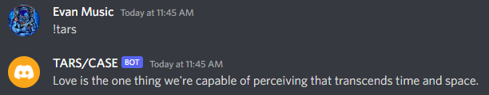
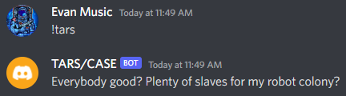
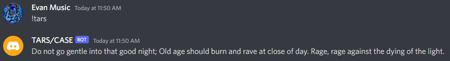
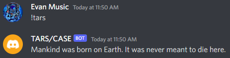
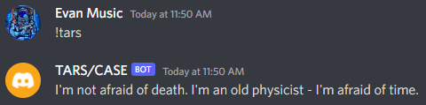
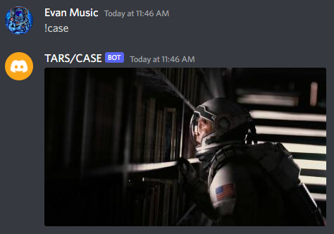
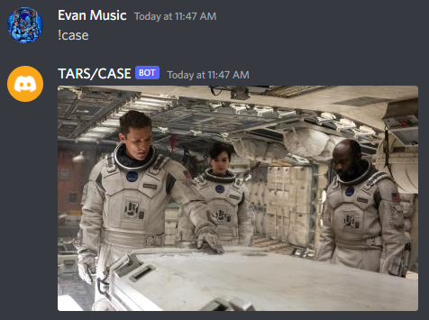
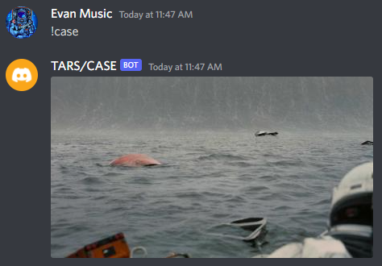

# Discord Bot Reasearch & Documentation

## Setup
- Dependencies
    - python3 (`sudo apt install python3`)
    - python pip (`sudo apt-get install python3-pip`)
    - discord.py (`pip install -U discord.py`)
    - python-dotenv (`pip install -U python-dotenv`)
- API Token
    - The Token is accessed through Discords developer portal when a new bot is created
    - A key can only be viewed once when it is created
    - If the key is lost or stolen a new one can be generated in the portal
        - Click on your Bots Application
        - Click `Bot` on the left
        - Click `Reset Token`
- What to do with the API Token
    - When a token is created, it needs to be copied and pasted into a `.env` file
    - The Token should be set equal to a variable that will be used to retrieve the key
    - In the `.env` file it will look like `DISCORD_TOKEN=your-bot-token`

## Usage
- Commands
    - `!tars`
        - This command will give a response of a quote from the movie *Interstellar*
    - `!case`
        - This command will give a response of an image from the movie *Interstellar*
- Screenshots
    - 
    - 
    - 
    - 
    - 
    - 
    - 
    - 

## Research
