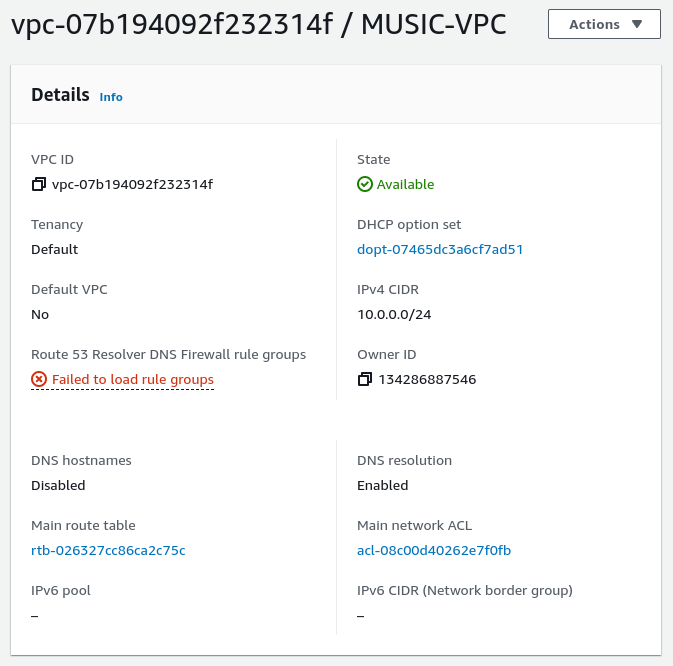
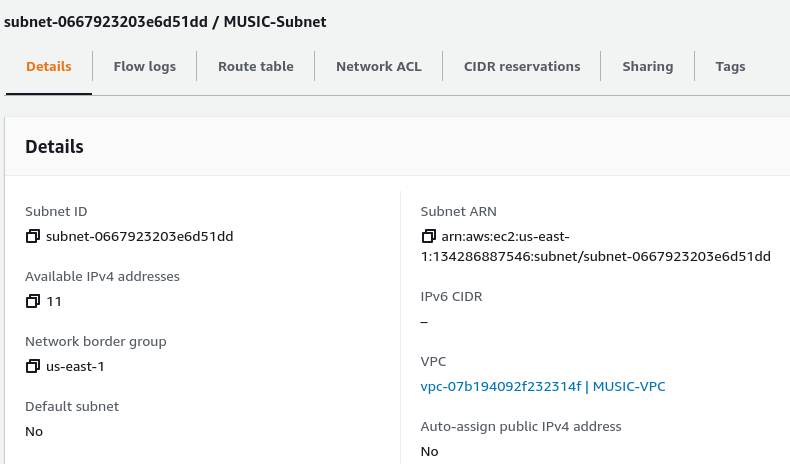
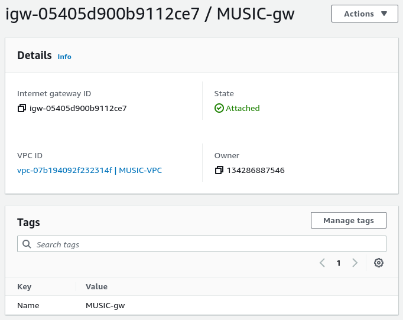
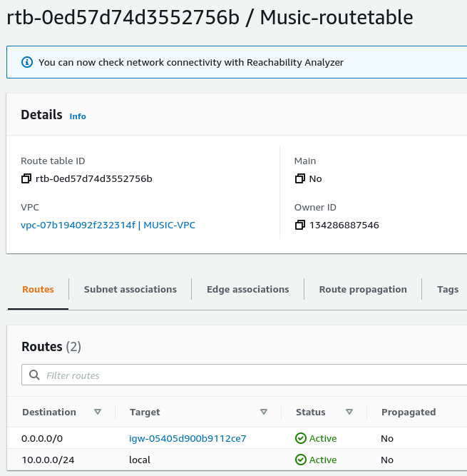
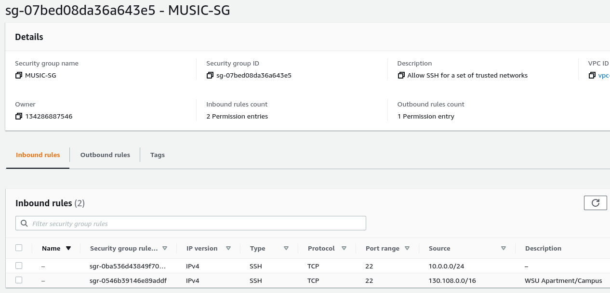
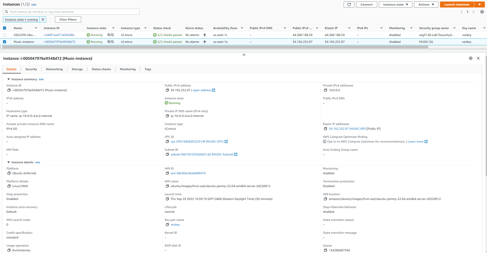
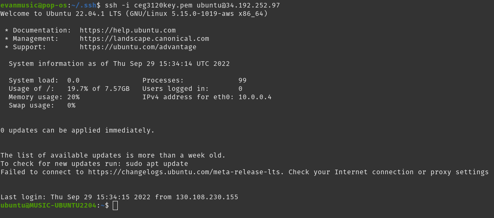

# Part 1 - Build a VPC

1. Create a VPC.
	- 
	- A VPC or Virtual Private Cloud is very similar to a physical network that you find all over the world but done virtually. The VPC is like a private network that is separated from all the other networks but can still talk to them if configured to do so.
	
2. Create a subnet
   	- 
   	- Within a VPC we can make many subnets, or as I like to think of it, more like a miniature network within our network. They can help break our network down into chunks to separate devices and make our network more efficient.
3. Create an internet gateway
   	- 
   	- A gateway is what allows your VPC to talk to the rest of the internet. Without a gateway for your data to travel across, it can never leave or enter the VPC.
   	
4. Create a route table
   	- 
   	- In a route table you can specify where certain data is routed. If you know that you want a specific type of data to be directed in a certain direction then you would add that to the table. It is like a set of rules that defines where your traffic needs to go.
   	
5. Create a security group
  	- 
  	- Security groups allow you to specify exactly what traffic is allowed to enter and exit the VPC. Specifying what traffic is allowed to come in allows your VPC to be more secure.

# Part 2 - EC2 instances

1. Create a new instance.
   - AMI selected
	   + Ubuntu Server 22.04
    - Default username 
	     + ubuntu
	- Instance type selected
	   + t2.micro
2. Attach the instance to your VPC.
	- Under the Network settings you can specify which VPC you want to attach to the instance in the drop down.
3. Determine whether a Public IPv4 address will be auto-assigned to the instance.
   - I said no, because if you have an auto-assigned IP amazon will automatically give you an IP address that will potentially change each time you start your Instance.
4. Attach a volume to your instance.
	- I stuck with the default configuration of 8gb of gp2 storage since we don't need anything crazy for this instance.
5. Tag your instance with a "Name" of "YOURLASTNAME-instance".
	- At the beginning of the Instance setup you can specify a name
6. Associate your security group, "YOURLASTNAME-sg" to your instance.
	- Under the network settings you click on "Select existing security group" and select the previously configured group. 
7. Reserve an Elastic IP address. Tag it with "YOURLASTNAME-EIP". Associate the Elastic IP with your instance.
	- Once you have created the instance there will be an "Actions" button at the top of the screen, click on "Networking" then, "Associate an Elastic IP address". Here you can assign either a static or dynamic address, I chose a static address so that the SSH command will always be the same and that I won't have to go get the IP every time I want to access the system.
8. Create a screenshot your instance details and add it to your project write up. 
   
9. `ssh` in to your instance. Change the hostname to "YOURLASTNAME-AMI"
	- `sudo hostnamectl set-hostname MUSIC-UBUNTU2204` is all it took to change the hostname
10. Create a screenshot your ssh connection to your instance and add it to your project write up - make sure it shows your new hostname.
	- 